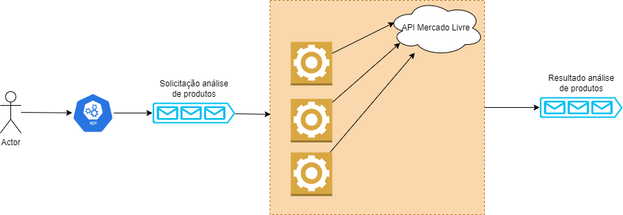

# ML-analise-produtos

Projeto feito para fins de estudo sobre arquiteturas assíncronas utilizando conceitos de APIs, Workers e Mensageria.

<b>Regra de negócio:</b> dada uma lista de produtos é necessário verificar quais desses produtos são vendidos no Mercado Livre e gerar um relatório para tomada de decisão sobre possíveis produtos sendo "pirateados". O relatório final deve conter o status da análise de cada produto.

Para tal, foram desenvolvidas as seguintes peças: 
- Configuração do RabbitMQ para servir como mensageria;
- Uma API REST em C# com .NET 6 para servir como porta de entrada para a lista de produtos a serem analisados, agrupar as mensagens em chunks e então enviar para uma fila no RabbitMQ;
- Um modelo de worker em C# com .NET 6 para ler os chunks de mensagens, efetuar as análises no Mercado Livre via API e gravar os resultados em uma fila no RabbitMQ.
- Docker e Docker Compose para configuração e execução das peças acima mencionadas.

## Passos para executar o projeto:

1 - Ter o Docker e Docker Compose configurados na máquina.

2 - Abrir o terminal, entrar na pasta <b><i>/infra</i></b> e executar <b><i>docker compose up</i></b>.

3 - Depois disso, terá em execução o RabbitMQ, API REST e os Workers aguardando os produtos chegarem.

4 - Basta enviar um HTTP Request via POST com a lista de produtos para http://localhost:8080/produtos/analise. Ex.: ["produto1", "produto2"].

5 - Então acessando http://localhost:15672 poderá ver o fluxo de mensagens ocorrendo nas filas.

6 - Por fim, para encerrar basta no terminal executar <b><i>ctrl + c</i></b> e <b><i>docker compose down</i></b>.

